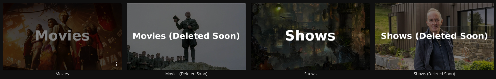

# Janitorr - Cleans up your media library

<p align="center">
    
</p>

### Inspiration

This application is heavily inspired by (but not a fork of) [Maintainerr](https://github.com/jorenn92/Maintainerr).
If you're within the Plex ecosystem, want an easy to use GUI and more sophisticated functionality, you're better off using it instead.

### Warning

Please use at your own risk.
You may enable dry-run mode. This is enabled in the config template by default.
Unless you disable dry-run mode, nothing will be deleted.
Refer to the logging section to see what actions Janitorr will take.

If you still don't trust Janitorr, you may enable Recycle Bin in the *arrs and disable Jellyfin/Emby.
This way, no deletes will be triggered on Jellyfin and everthing triggered in the *arrs will only go to the Recycle Bin.

### Introduction

**Janitorr** manages your media and cleans up after you.

- Do you hate being the janitor of your server?
- Do you have a lot of media that never gets watched?
- Do your users constantly request media, and let it sit there afterward never to be touched again?

Then you need Janitorr for Jellyfin and Emby.
It's THE solution for cleaning up your server and freeing up space before you run into issues.

## 📚 Documentation

Comprehensive documentation is available in multiple languages:

- **🇬🇧 English Documentation**
  - [Wiki Home](docs/wiki/en/Home.md)
  - [Docker Compose Setup Guide](docs/wiki/en/Docker-Compose-Setup.md)
  - [Configuration Guide](docs/wiki/en/Configuration-Guide.md)
  - [FAQ](docs/wiki/en/FAQ.md)
  - [Troubleshooting](docs/wiki/en/Troubleshooting.md)

- **🇪🇸 Documentación en Español**
  - [Inicio de la Wiki](docs/wiki/es/Home.md)
  - [Guía de Configuración con Docker Compose](docs/wiki/es/Configuracion-Docker-Compose.md)
  - [Guía de Configuración](docs/wiki/es/Guia-Configuracion.md)
  - [Preguntas Frecuentes](docs/wiki/es/Preguntas-Frecuentes.md)
  - [Solución de Problemas](docs/wiki/es/Solucion-Problemas.md)

## Features

- **Web-based Management UI** - Monitor status and manually trigger cleanup functions through a user-friendly web interface
- Remote deletion, disk space aware deletion as well as tag based delete schedules
- Exclude items from deletion via tags in Sonarr/Radarr
- Configure expiration times for your media in the *arrs - optionally via Jellystat
- Season by season removal for TV shows, removing entire shows or only keep a minimum number of episodes for weekly shows
- Clear requests from Jellyseerr and clean up leftover metadata in Jellyfin so no orphaned files are left
- Show a collection, containing rule matched media, on the Jellyfin home screen for a specific duration before deletion. Think: "Leaving soon"



### Important notes

- Janitorr does **not** delete items after they were watched. Look into [Jellyfin Media Cleaner](https://github.com/shemanaev/jellyfin-plugin-media-cleaner) for that.
- **I don't use Emby. I implemented and tested it, but for maintenance I rely on bug reports**
- Only one of Jellyfin or Emby can be enabled at a time
- Only one of Jellystat or Streamystats can be enabled at a time
- "Leaving Soon" Collections are *always* created and do not care for dry-run settings
- Jellyfin and Emby require user access to delete files, an API key is not enough - I recommend creating a user specifically for this task
- **For media to be picked up, it needs to have been downloaded by the Radarr/Sonarr**
- Jellyfin/Emby and Jellyseerr are not required, but if you don't supply them, you may end up with orphaned folders,  metadata, etc

### Management UI

Janitorr includes a web-based management interface accessible at `http://<host>:<port>/` when the application is running.

The management UI allows you to:
- View the current system status and configuration
- Manually trigger any cleanup function on-demand
- Monitor which cleanups have been executed
- See real-time feedback on cleanup operations

For more details, see [MANAGEMENT_UI.md](MANAGEMENT_UI.md).

### Logging
You may check the container logs for Janitorr to observe what the application wants to do.
Janitorr logs to stdout, so you can view your logs in Docker. However, it is recommended to enable file logging in your config instead.
If file logging is enabled, please make sure the location you've chosen for the log file is mapped into the container, so that Janitorr can write log files to the host and not inside the container.

To enable debug logging, change `INFO` in the following line in `application.yml` to either `DEBUG` or `TRACE`:

```yml
    com.github.schaka: INFO
```

### Troubleshooting
Before you create a new issue, please check previous issues to make sure nobody has faced the same problem before.

**📖 Check the documentation:**
- [English Troubleshooting Guide](docs/wiki/en/Troubleshooting.md)
- [English FAQ](docs/wiki/en/FAQ.md)
- [Guía de Solución de Problemas (Español)](docs/wiki/es/Solucion-Problemas.md)
- [Preguntas Frecuentes (Español)](docs/wiki/es/Preguntas-Frecuentes.md)

If you still need help, start a [new discussion](https://github.com/carcheky/janitorr/discussions).

## Setup

Currently, the code is only published as a docker image to [GitHub](https://github.com/Schaka/janitorr/pkgs/container/janitorr).
If you cannot use Docker, you'll have to compile it yourself from source.

Depending on the configuration, files will be deleted if they are older than x days. Age is determined by your grab
history in the *arr apps. By default, it will choose the oldest file in the history.
If Jellystat or Streamystats is set up, the most recent watch date overwrites the grab history, if it exists.

To exclude media from being considered from deletion, set the `janitorr_keep` tag in Sonarr/Radarr. The actual tag
Janitorr looks for can be adjusted in your config file.

### Setting up Docker

> **📖 For a comprehensive step-by-step guide, see the [Docker Compose Setup Guide](docs/wiki/en/Docker-Compose-Setup.md)** (also available in [Spanish](docs/wiki/es/Configuracion-Docker-Compose.md))

- follow the mapping for `application.yml` examples below
- within that host folder, put a copy of [application.yml](https://github.com/Schaka/janitorr/blob/develop/src/main/resources/application-template.yml) from this repository
- adjust said copy with your own info like *arr, Jellyfin and Jellyseerr API keys and your preferred port

If using Jellyfin with **filesystem access**, ensure that Janitorr has access to the exact directory structure for the leaving-soon-dir as Jellyfin.
Additionally, make sure the *arrs directories are mapped into your container the same way for Janitorr as well.
Janitorr receives info about where files are located by the *arrs - so the path needs to be available to both.

Janitorr creates symlinks from whatever directory it receives from the arrs' API into the `leaving-soon-dir`.
If Radarr finds movies at `/data/media/movies` Janitorr needs to find them at `/data/media/movies` too.
You need to ensure links can be created from the source (in the *arrs' library) to the destination (leaving-soon).

The only exception is your `leaving-soon-dir`. If Jellyfin and Janitorr know this directory under different paths, you can just this.
By default, both `media-server-leaving-soon-dir` and `leaving-soon-dir` should be identical if your volume mappings are identical.


If Janitorr's mapping looks like this:
`/share_media/media/leaving-soon:/data/media/leaving-soon`

And Jellyfin's like this:
`/share_media/media/leaving-soon:/library/leaving-soon`

Then your `application.yml` should look like:
```
leaving-soon-dir: "/data/media/leaving-soon"
media-server-leaving-soon-dir: "/library/leaving-soon"
```

**You may also check out [this example](examples/example-compose.yml) of a full stack setup.**

### Docker config

Before using this, please make sure you've created the `application.yml` file and put it in the correct config directory you intend to map.
The application requires it. You need to supply it, or Janitorr will not start correctly.
You don't have to publish ANY ports on the host machine.
If you're seeing any problems, consult [the Wiki](https://github.com/Schaka/janitorr/wiki/Troubleshooting).

An example of a `docker-compose.yml` may look like this:

```yml
services:
  janitorr:
    container_name: janitorr
    image: ghcr.io/carcheky/janitorr:jvm-stable
    user: 1000:1000 # Replace with your user who should own your application.yml file
    mem_limit: 256M # is used to dynamically calculate heap size, can go as low as 200MB, but 256 is recommended - higher for very large libraries
    mem_swappiness: 0
    volumes:
      - /appdata/janitorr/config/application.yml:/config/application.yml
      - /appdata/janitorr/logs:/logs
      - /share_media:/data
    environment:
      # Uses https://github.com/dmikusa/tiny-health-checker supplied by paketo buildpacks
      - THC_PATH=/health
      - THC_PORT=8081
    healthcheck:
      test: [ "CMD", "/workspace/health-check" ]
      start_period: 30s
      interval: 5s
      retries: 3
```

**The native image is now deprecated as of 1.9.0. Please switch to the JVM image.**
[Oracle has announced](https://blogs.oracle.com/java/post/detaching-graalvm-from-the-java-ecosystem-train) that the GraalVM will be "detached" from the ecosystem.
Despite employees [chiming in on Reddit](https://www.reddit.com/r/java/comments/1niamuc/comment/nehsqww) saying it won't be going anywhere, its future is a bit uncertain.
I had originally implemented it due to fast runtimes and lower memory footprint, but it requires a lot of workarounds and upkeep to save barely 100MB of RAM.
Please see release notes for 1.9.0 for a thorough explanation.

A native image is also published for every build. It keeps a lower memory and CPU footprint and doesn't require longer runtimes to achieve optimal performance (JIT).
That image is always tagged `:native-stable`. To get a specific version, use `:native-v1.x.x`.
**While I do publish an arm64 version of this image, it is mostly untested.**

```yml
services:
  janitorr:
    container_name: janitorr
    image: ghcr.io/carcheky/janitorr:native-stable
    user: 1000:1000 # Replace with your user who should own your application.yml file
    volumes:
      - /appdata/janitorr/config/application.yml:/config/config.yml
      - /appdata/janitorr/logs:/logs
      - /share_media:/data
    environment:
      # Uses https://github.com/dmikusa/tiny-health-checker supplied by paketo buildpacks
      - THC_PATH=/health
      - THC_PORT=8081
      - SPRING_CONFIG_ADDITIONAL_LOCATION=/config/application.yml
    healthcheck:
      test: [ "CMD", "/workspace/health-check" ]
      start_period: 30s
      interval: 5s
      retries: 3
```

To get the latest build as found in the development branch, grab the following image: `ghcr.io/carcheky/janitorr:jvm-develop`.
The development version of the native image is available as `ghcr.io/carcheky/janitorr:native-develop`.


## JetBrains
Thank you to [ JetBrains](http://www.jetbrains.com/) for providing us with free licenses to their great tools.

* [ IntelliJ Idea](https://www.jetbrains.com/idea/)
* [ WebStorm](http://www.jetbrains.com/webstorm/)
* [ Rider](http://www.jetbrains.com/rider/)
